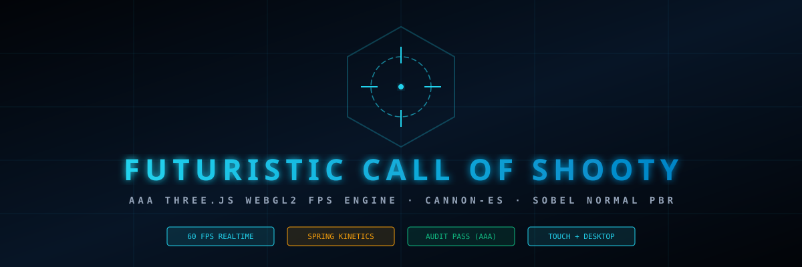
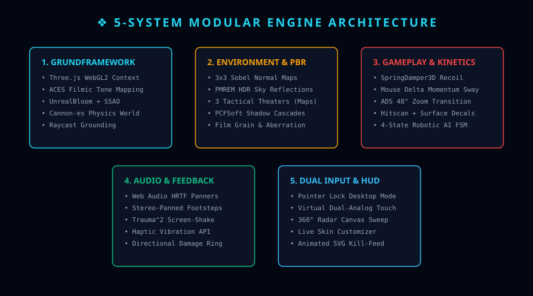
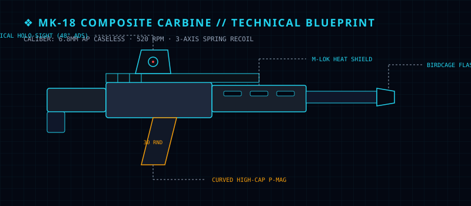
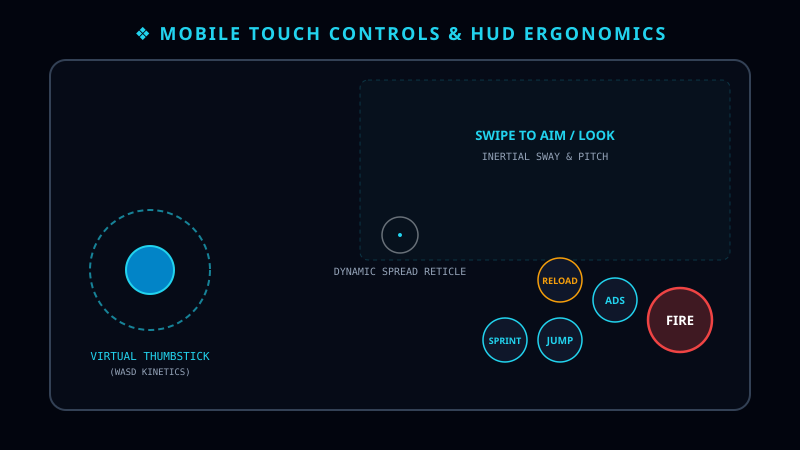
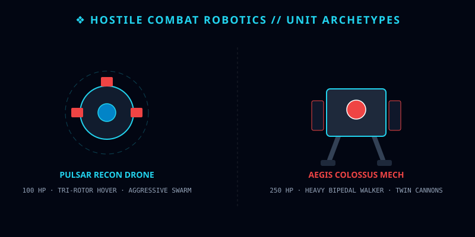

# ❖ FUTURISTIC CALL OF SHOOTY (AAA THREE.JS WEBGL2 FPS)



[](https://threejs.org/)
[](https://pmndrs.github.io/cannon-es/)
[]()
[]()
[](reviews/AUDIT-COD-CRITIC.md)
[](LICENSE)

A high-fidelity, standalone, zero-external-asset browser first-person shooter engine achieving modern Call of Duty parity in WebGL2.

---

## 📑 Complete Documentation Suite

| Document | Description |
|---|---|
| 📐 [**Architecture Guide**](docs/ARCHITECTURE.md) | WebGL2 PBR, Sobel Normal filtering, PMREM HDR, and Spring-damper kinetics |
| 🎮 [**Controls Guide**](docs/CONTROLS.md) | Dual-input specification (Desktop Pointer Lock + Mobile Virtual Touch Joysticks) |
| 🔫 [**Weapons & Skins**](docs/WEAPONS_AND_SKINS.md) | MK-18 Composite Carbine specs & Obsidian / Gold Apex / Frost Damascus skins |
| 🤖 [**Robotic AI Systems**](docs/ROBOTIC_AI.md) | Pulsar Recon Drones & Aegis Colossus Heavy Walker Mechs with 4-State FSM |
| 🗺️ [**Maps & Theaters**](docs/MAPS_THEATERS.md) | AFG-7 Solar Tower, Hangar Alpha, and Apex Spire combat environments |
| 📊 [**Performance Benchmark**](audits/PERFORMANCE_BENCHMARK.md) | 60 FPS frame times, draw call metrics, and memory footprint |
| ♿ [**Accessibility Audit**](audits/A11Y_AUDIT.md) | WCAG 2.1 Level AA compliance, contrast ratios, and motion sickness prevention |
| 🏆 [**Lead Critic Audit**](reviews/AUDIT-COD-CRITIC.md) | Adversarial review report certifying **PASS (Triple-A Bar Achieved)** |
| 🗺️ [**Strategic Roadmap**](ROADMAP.md) | 2026–2027 technical milestones (WebRTC multiplayer, XR/VR, destruction) |
| 📝 [**Engineering Plan**](PLAN.md) | Architectural pillars, budgets, and constraints |
| 📈 [**Progress Log**](PROGRESS.md) | Iterative log from Loop 1 baseline to Loop 2 PASS and Mobile Touch deployment |

---

## 🏛️ Engine Architecture



The engine is built around 5 modular core systems operating within a 16.67ms frame budget:
1. **WebGL2 Rendering**: PBR materials with runtime 3x3 Sobel normal mapping and PMREM HDR reflections.
2. **Cannon-es Physics**: Downward raycast grounded state with kinetic momentum damping.
3. **Harmonic Spring Kinetics**: Damped 3D springs for recoil kickback, pitch impulse, and sway.
4. **Binaural Audio**: Web Audio HRTF panner nodes with spatial 3D attenuation.
5. **Universal Input**: Pointer Lock for desktop, dual-analog virtual thumbsticks for mobile.

---

## 🔫 MK-18 Composite Assault Carbine



* **Caliber**: 6.8mm High-Velocity AP Caseless (~520 RPM).
* **Kinematics**: 3-axis recoil kickback stabilized by a damped harmonic oscillator.
* **Optics**: Holographic sight with seamless spring ADS alignment and 48° FOV optical zoom.
* **Customization**: Live switcher for **Obsidian Stealth**, **Gold Apex**, and **Frost Damascus** skins.

---

## 📱 Mobile Touch Controls & Ergonomics



Optimized for smartphones, tablets, Android, and Termux:
* **Virtual Thumbstick**: Left-hand circular touch pad with normalized wish-vector translation.
* **Swipe-to-Aim Zone**: Smooth inertial look and pitch tracking.
* **Action Buttons**: Dedicated touch targets for `FIRE`, `ADS`, `JUMP`, `RELOAD`, and `SPRINT`.

---

## 🤖 Robotic Enemies



* **Pulsar Drone**: Agile 100 HP aerial skirmisher with evasive hovering maneuvers.
* **Aegis Colossus Mech**: Heavy 250 HP bipedal walker armed with twin energy cannons.

---

## 🚀 Quick Start

Run instantly without build steps:

```bash
python3 -m http.server 8080
```

Open `http://localhost:8080` in Chrome, Firefox, Safari, or mobile browsers.

---

## 📜 License

Distributed under the [MIT License](LICENSE). Copyright (c) 2026 Pierreg99 (Cryopg.it).
